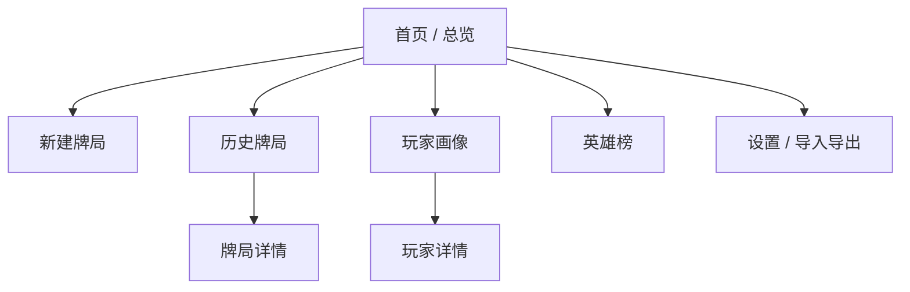
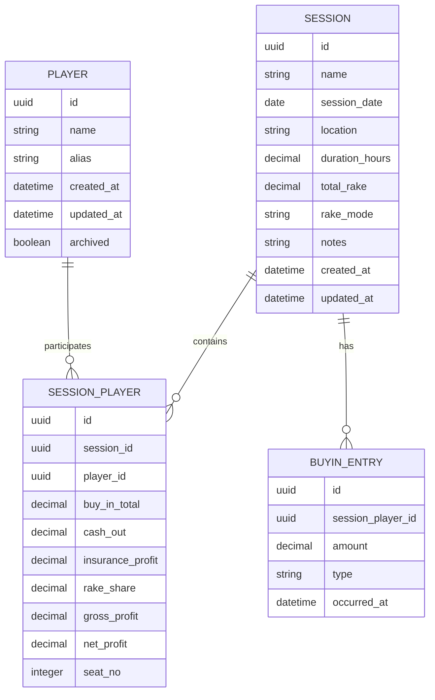

# 扑克账本产品设计文档

## 1. 产品概述

### 1.1 产品名称
`开局账本`

### 1.2 产品定位
一款面向个人用户的扑克战绩记录工具，核心目标是把每场德州扑克牌局中的买入、兑出、抽水、保险和时长沉淀为可回顾、可统计、可比较的长期数据资产。

### 1.3 产品目标
- 低成本记录单场牌局结果，减少记账摩擦。
- 自动计算单场盈利、抽水分摊、每小时表现等核心指标。
- 以玩家为中心沉淀长期战绩，输出画像、曲线和排名。
- 支持个人本地使用，后续平滑扩展到 iOS 和云同步。

### 1.4 当前版本建议
- `V1`：单用户、本地优先、Web 端可用。
- `V1.5`：iOS 封装，沿用同一套数据模型。
- `V2`：账号体系、云同步、多设备共享、备份恢复。

## 2. 用户与场景

### 2.1 目标用户
- 经常参加德州扑克现金局的个人玩家。
- 希望长期复盘战绩、跟踪不同玩家交手结果的组织者或常驻玩家。

### 2.2 核心使用场景
1. 一场牌局结束后，录入每位玩家的 `buy-in`、`cash out`、保险结果和抽水。
2. 查看某位玩家在所有牌局中的累计净盈利、ROI、平均买入和盈利曲线。
3. 按净盈利、时薪、场次等维度查看“英雄榜”。
4. 导出账本备份，在新设备上导入恢复。

## 3. 范围定义

### 3.1 V1 必做
- 新建牌局
- 维护玩家库
- 记录玩家买入、兑出、保险、抽水分摊
- 自动计算单场和累计统计
- 历史牌局列表
- 玩家画像
- 英雄榜
- JSON 导入导出

### 3.2 V1 可选增强
- 多次补码明细
- 单场备注与标签
- 场地维度统计
- 删除/编辑历史牌局
- 数据异常校验提示

### 3.3 V2 再做
- 登录与云同步
- 多端数据一致性
- 自定义统计报表
- 银行roll曲线
- 手牌/局后笔记
- 多币种支持

## 4. 核心业务规则

### 4.1 指标定义
- 单玩家毛盈利 = `cash_out + insurance_profit - buy_in`
- 单玩家净盈利 = `cash_out + insurance_profit - buy_in - rake_share`
- 单场总抽水 = 录入的牌局抽水总额
- 每小时抽水 = `session_rake / duration_hours`
- 玩家平均买入 = `累计 buy_in / 参与场次`
- 玩家时薪 = `累计净盈利 / 累计参与小时数`
- 玩家 ROI = `累计净盈利 / 累计 buy_in`

### 4.2 抽水分摊规则
- `equal`：参与玩家均摊
- `buyin_ratio`：按买入金额占比分摊
- `custom`：手动录入每位玩家分摊值

### 4.3 数据校验规则
- 牌局名称、日期、至少一位玩家必填
- `buy_in`、`cash_out`、`rake` 默认不允许小于 `0`
- `duration_hours` 必须大于 `0`
- 玩家姓名在玩家库内唯一，按规范化名称去重
- `custom` 模式下，应校验各玩家抽水分摊和是否约等于总抽水
- 应提供“资金平衡检查”指标：
  - `sum(cash_out) - sum(buy_in) - rake`
  - 若不接近 `0`，提示用户数据可能遗漏

## 5. 信息架构



## 6. 领域模型

### 6.1 核心实体
- `Player`：玩家基础信息
- `Session`：一场牌局
- `SessionPlayer`：玩家与牌局的关联记录，也是单场统计事实表
- `BuyInEntry`：补码明细，可选扩展
- `Tag`：牌局标签，可选扩展

### 6.2 ER 关系



## 7. 数据库设计

### 7.1 存储策略建议

#### V1：本地优先
- Web 端：优先使用 `IndexedDB`
- 封装层：通过 repository/service 层隔离存储实现
- 备份方式：JSON 导入导出

#### V2：同步增强
- 云端主库：`PostgreSQL`
- 客户端缓存：`SQLite` 或 `IndexedDB`
- 同步策略：以 `updated_at` + `deleted_at` 做增量同步

原因：
- 个人工具最重要的是“快记、不断网、可恢复”
- 先本地后同步，复杂度更低，也更适合当前产品阶段

### 7.2 逻辑表设计

#### `players`

| 字段 | 类型 | 说明 |
| --- | --- | --- |
| `id` | UUID | 主键 |
| `name` | VARCHAR(64) | 玩家名称，唯一 |
| `alias` | VARCHAR(64) | 可选昵称 |
| `notes` | TEXT | 玩家备注 |
| `archived` | BOOLEAN | 是否归档 |
| `created_at` | DATETIME | 创建时间 |
| `updated_at` | DATETIME | 更新时间 |

索引建议：
- 唯一索引：`uniq_players_name`
- 普通索引：`idx_players_archived`

#### `sessions`

| 字段 | 类型 | 说明 |
| --- | --- | --- |
| `id` | UUID | 主键 |
| `name` | VARCHAR(128) | 牌局名称 |
| `session_date` | DATE | 牌局日期 |
| `location` | VARCHAR(128) | 地点 |
| `duration_hours` | DECIMAL(6,2) | 时长 |
| `total_rake` | DECIMAL(12,2) | 总抽水 |
| `hourly_rake` | DECIMAL(12,2) | 每小时抽水，可冗余存储 |
| `rake_mode` | VARCHAR(16) | equal / buyin_ratio / custom |
| `notes` | TEXT | 备注 |
| `created_at` | DATETIME | 创建时间 |
| `updated_at` | DATETIME | 更新时间 |
| `deleted_at` | DATETIME NULL | 软删除时间 |

索引建议：
- `idx_sessions_date`
- `idx_sessions_location`
- `idx_sessions_deleted_at`

#### `session_players`

| 字段 | 类型 | 说明 |
| --- | --- | --- |
| `id` | UUID | 主键 |
| `session_id` | UUID | 关联牌局 |
| `player_id` | UUID | 关联玩家 |
| `seat_no` | INTEGER NULL | 座位号，可选 |
| `buy_in_total` | DECIMAL(12,2) | 买入总额 |
| `cash_out` | DECIMAL(12,2) | 兑出 |
| `insurance_profit` | DECIMAL(12,2) | 保险盈利 |
| `rake_share` | DECIMAL(12,2) | 抽水分摊 |
| `gross_profit` | DECIMAL(12,2) | 毛盈利 |
| `net_profit` | DECIMAL(12,2) | 净盈利 |
| `created_at` | DATETIME | 创建时间 |
| `updated_at` | DATETIME | 更新时间 |

索引建议：
- `idx_session_players_session_id`
- `idx_session_players_player_id`
- 唯一索引：`uniq_session_players_session_player`

#### `buyin_entries`（扩展表）

| 字段 | 类型 | 说明 |
| --- | --- | --- |
| `id` | UUID | 主键 |
| `session_player_id` | UUID | 关联单场玩家记录 |
| `amount` | DECIMAL(12,2) | 金额 |
| `type` | VARCHAR(16) | initial / rebuy / addon |
| `occurred_at` | DATETIME | 发生时间 |
| `notes` | TEXT | 备注 |

### 7.3 推荐 SQL DDL

```sql
create table players (
  id text primary key,
  name text not null unique,
  alias text,
  notes text,
  archived integer not null default 0,
  created_at text not null,
  updated_at text not null
);

create table sessions (
  id text primary key,
  name text not null,
  session_date text not null,
  location text,
  duration_hours numeric not null check (duration_hours > 0),
  total_rake numeric not null default 0 check (total_rake >= 0),
  hourly_rake numeric not null default 0,
  rake_mode text not null check (rake_mode in ('equal', 'buyin_ratio', 'custom')),
  notes text,
  created_at text not null,
  updated_at text not null,
  deleted_at text
);

create table session_players (
  id text primary key,
  session_id text not null references sessions(id),
  player_id text not null references players(id),
  seat_no integer,
  buy_in_total numeric not null default 0 check (buy_in_total >= 0),
  cash_out numeric not null default 0 check (cash_out >= 0),
  insurance_profit numeric not null default 0,
  rake_share numeric not null default 0 check (rake_share >= 0),
  gross_profit numeric not null,
  net_profit numeric not null,
  created_at text not null,
  updated_at text not null,
  unique (session_id, player_id)
);

create index idx_sessions_date on sessions(session_date desc);
create index idx_session_players_player_id on session_players(player_id);
create index idx_session_players_session_id on session_players(session_id);
```

### 7.4 JSON 导出结构建议

```json
{
  "version": 1,
  "exportedAt": "2026-06-27T09:00:00.000Z",
  "players": [],
  "sessions": [],
  "sessionPlayers": [],
  "buyinEntries": []
}
```

## 8. 计算层设计

### 8.1 服务层职责
- `sessionService`
  - 创建牌局
  - 校验牌局
  - 计算抽水分摊
  - 写入牌局与单场玩家记录
- `playerStatsService`
  - 汇总玩家累计净盈利、平均买入、时薪、ROI
  - 生成玩家盈利曲线
- `leaderboardService`
  - 根据指标生成排行榜
  - 支持按玩家名单过滤
- `importExportService`
  - JSON 导入校验
  - JSON 版本兼容

### 8.2 关键计算伪代码

```ts
grossProfit = cashOut + insuranceProfit - buyInTotal
netProfit = grossProfit - rakeShare
hourlyProfit = totalNetProfit / totalHours
roi = totalBuyIn > 0 ? totalNetProfit / totalBuyIn : 0
```

### 8.3 抽水分摊伪代码

```ts
if (mode === "equal") {
  rakeShare = totalRake / playerCount
}

if (mode === "buyin_ratio") {
  rakeShare = totalRake * (playerBuyIn / totalBuyIn)
}

if (mode === "custom") {
  rakeShare = inputValue
}
```

建议：
- 统一保留两位小数
- 最后一位玩家吃余数，保证分摊和严格等于总抽水

## 9. 接口与模块边界

### 9.1 前端模块划分
- `pages/`
  - `Dashboard`
  - `SessionCreate`
  - `SessionHistory`
  - `PlayerProfile`
  - `Leaderboard`
- `components/`
  - 指标卡片
  - 玩家录入行
  - 盈利曲线图
  - 筛选器
- `services/`
  - `storageService`
  - `sessionService`
  - `statsService`
- `repositories/`
  - `playerRepository`
  - `sessionRepository`
  - `sessionPlayerRepository`

### 9.2 若未来做云端 API

#### 示例接口
- `POST /sessions`
- `GET /sessions`
- `GET /sessions/:id`
- `PUT /sessions/:id`
- `GET /players`
- `GET /players/:id/stats`
- `GET /leaderboard?metric=net_profit`
- `POST /imports`
- `GET /exports/latest`

## 10. 终端呈现设计

这里的“终端”指用户实际使用的前端载体，优先覆盖 `Web` 与 `iOS`。

### 10.1 设计原则
- 录入优先：一场牌局应在 1 到 2 分钟内完成录入
- 结果优先：关键指标比原始字段更先被看到
- 本地可信：用户明确知道数据已保存，可导出备份
- 低学习成本：尽量用账本和计分卡式布局

### 10.2 Web 端页面结构

#### A. 首页总览
目的：
- 让用户一打开就知道目前累积了多少场、多少人、总盈利多少

模块：
- 顶部 Hero 区
- 核心统计卡片
- 最近牌局列表
- 快捷入口

建议展示字段：
- 累计牌局数
- 累计玩家数
- 总买入
- 总净盈利
- 总抽水
- 平均每小时抽水

#### B. 新建牌局页
目的：
- 快速完成单场记录

模块：
- 基础信息区：名称、日期、地点、时长、抽水、备注
- 玩家录入区：姓名、买入、兑出、保险、手动抽水
- 实时计算区：总买入、总兑出、总保险、总抽水、平衡检查
- 提交按钮

交互重点：
- 支持从玩家库自动补全玩家姓名
- 切换抽水模式时自动更新预估结果
- 校验异常时高亮提醒，不阻塞正常编辑

#### C. 历史牌局页
目的：
- 浏览过去所有牌局并快速回看表现

列表卡片信息：
- 牌局名称
- 日期
- 地点
- 时长
- 单场总净盈利
- 抽水
- 前 3 到 4 名关键玩家结果

后续可扩展：
- 搜索
- 日期筛选
- 地点筛选
- 标签筛选

#### D. 玩家画像页
目的：
- 从单个玩家视角复盘长期战绩

模块：
- 玩家选择器
- 指标卡片
- 盈利曲线
- 历史参与牌局列表

关键指标：
- 累计净盈利
- 平均买入
- 每小时盈利
- 参与场次
- 保险累计
- ROI

#### E. 英雄榜页
目的：
- 支持按不同指标比较玩家表现

模块：
- 指标切换器
- 玩家筛选输入
- 排名列表

支持排序字段：
- 净盈利
- 每小时盈利
- 平均买入
- 参与场次
- ROI

#### F. 设置页
模块：
- 导出 JSON
- 导入 JSON
- 数据清理
- 版本信息
- 统计口径说明

### 10.3 iOS 端呈现建议

#### 导航结构
- `Tab 1`：总览
- `Tab 2`：记一场
- `Tab 3`：玩家
- `Tab 4`：排名
- `Tab 5`：设置

#### iOS 交互优化
- 新建牌局页固定底部主按钮：`保存这场牌局`
- 数字输入区使用数字键盘
- 常用玩家支持最近使用推荐
- 卡片与折叠分组适配小屏

### 10.4 视觉建议
- 风格关键词：`账本感`、`牌桌感`、`克制但有质感`
- 主色：暖米色背景 + 红棕强调色 + 墨绿正向值
- 字体层级：标题偏展示感，正文偏易读
- 正负值颜色明确区分
- 图表避免复杂，优先折线和条形图

## 11. 状态管理与数据流

### 11.1 前端状态层建议
- `draftSessionState`：当前编辑中的牌局表单
- `playersState`：玩家库
- `sessionsState`：历史牌局
- `filtersState`：筛选条件

### 11.2 数据流
1. 用户填写牌局表单
2. 本地状态实时计算指标
3. 点击保存后写入 `sessions` 与 `session_players`
4. 汇总统计重新计算
5. 页面各模块响应式刷新

## 12. 异常与边界处理

### 12.1 异常场景
- 导入 JSON 结构不合法
- 同名玩家重复导入
- 单场抽水分摊不等于总抽水
- 牌局时长为 `0`
- 资金平衡差值过大

### 12.2 处理策略
- 导入前先版本校验
- 导入采用“预览后确认”模式
- 同名玩家可选“合并”或“保留两条”
- 计算异常提供黄/红色提示，但不强制拦截所有场景

## 13. 安全与备份

### 13.1 V1
- 不依赖服务端账号
- 默认所有数据仅存储在本地设备
- 提醒用户定期导出备份

### 13.2 V2
- 登录态
- 云端加密存储
- 自动备份
- 历史版本回滚

## 14. 推荐技术方案

### 14.1 V1 推荐
- 前端：`HTML + CSS + JavaScript` 或 `React`
- 本地存储：`IndexedDB`
- 图表：轻量 SVG 自绘或 `Chart.js`
- 打包：Web 静态站点

### 14.2 iOS 推荐
- 若要快速复用 Web：`Capacitor`
- 若追求系统体验：`SwiftUI + SQLite/SwiftData`

### 14.3 为什么不建议继续只用 localStorage
- 结构简单但不适合长期扩展
- 难以做复杂查询
- 体量增长后维护性差
- 不利于未来同步和迁移

## 15. 里程碑建议

### 里程碑 1：补齐 V1 数据层
- 从 `localStorage` 迁移到标准 repository 模型
- 明确 `players / sessions / session_players` 三表结构
- 完成导入导出版本化

### 里程碑 2：补齐编辑能力
- 历史牌局详情页
- 编辑牌局
- 删除牌局
- 更强的校验提示

### 里程碑 3：移动端适配
- 响应式优化
- iOS 封装
- 小屏录入体验优化

### 里程碑 4：云同步
- 登录
- PostgreSQL
- 增量同步
- 冲突处理

## 16. 与当前原型的对应关系

当前仓库中的网页原型已经覆盖了以下内容：
- 新建牌局
- 玩家库
- 历史牌局列表
- 玩家画像
- 英雄榜
- JSON 导入导出

下一步最值得优先补的不是页面数量，而是“数据层正式化”：
- 把当前以内存对象 + `localStorage` 为中心的实现，升级为清晰的领域模型和持久层接口
- 为后续编辑、删除、同步和 iOS 复用打基础

## 17. 结论

这款产品最适合走“本地优先、记录优先、统计驱动”的路线。  
`V1` 不必急着做重后端，重点是把数据结构、计算规则和前端路径一次设计稳。  
等 Web 端的记账流程和统计口径稳定后，再接 iOS 封装和云同步，整体成本最低，也最符合个人工具的成长节奏。
